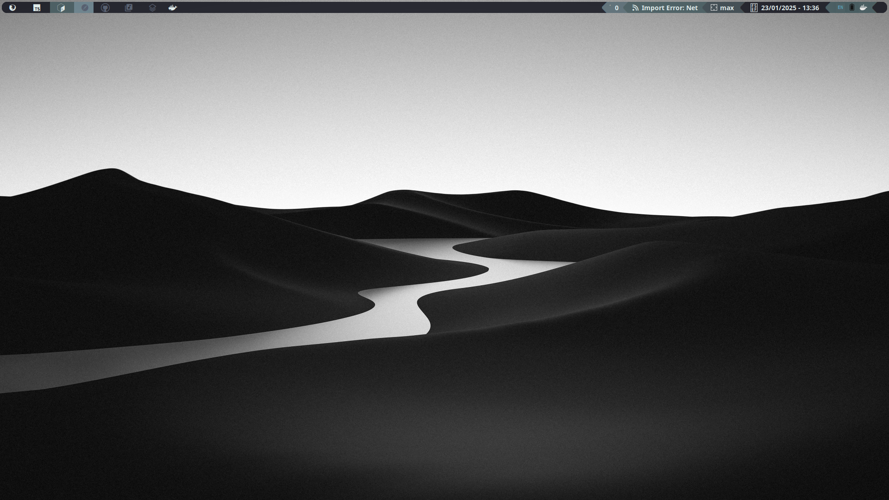
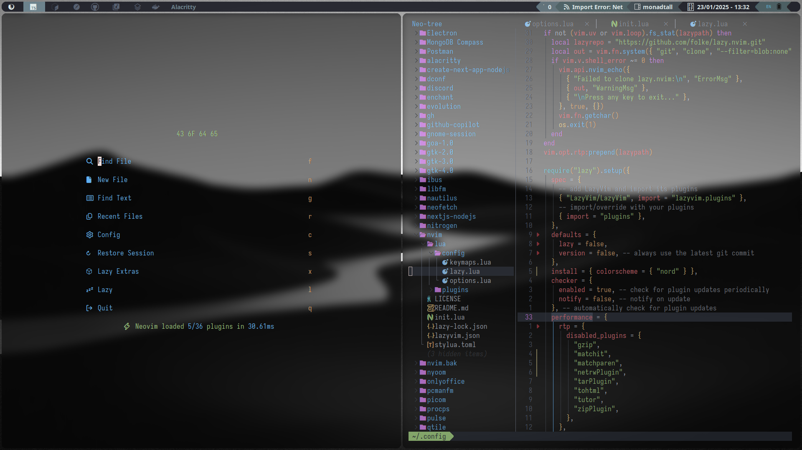
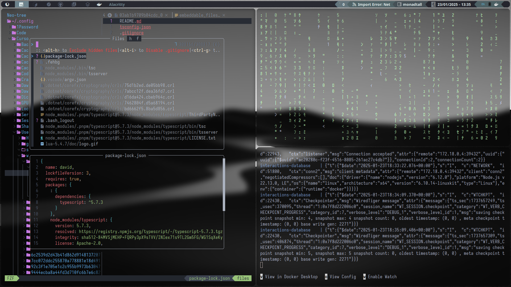

# David's dotfiles

**Warning**: Don’t blindly use my settings unless you know what that entails. Use at your own risk!

## Contents

-   Vim (Neovim) config
-   Alacritty config
-   Qtile config
-   Picom config
-   Wallpaper collection

## About me

-   [Linkedin](www.linkedin.com/in/david-agamez)
